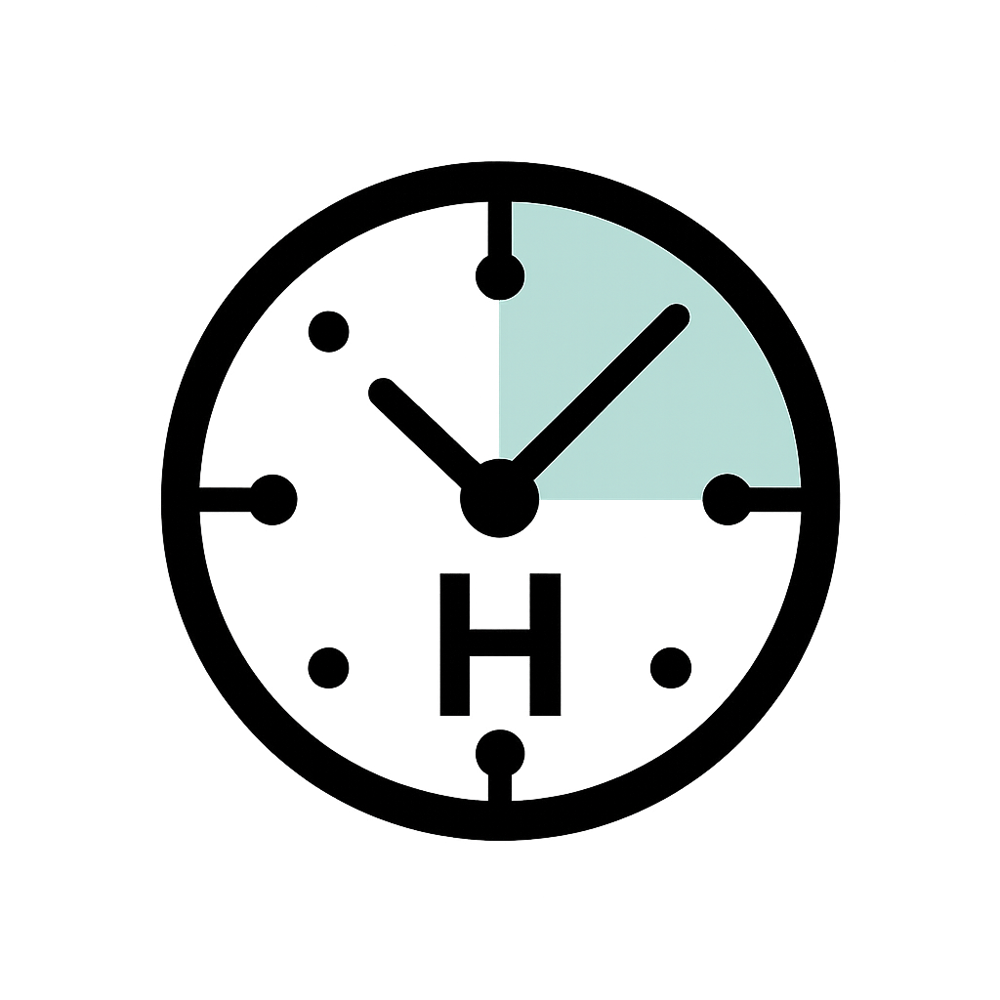

<p align="center"></p>

# Horologic MCP

**TypeScript Model Context Protocol (MCP) Time Server by Yoda Digital**

---

Horologic MCP is a reliable Model Context Protocol (MCP) server for time and timezone operations, built with TypeScript. It provides seamless integration with Claude Desktop and other MCP-compatible clients, offering the same functionality as the [Python time reference server](https://github.com/modelcontextprotocol/servers/tree/main/src/time).

## Key Features

- **Time & Timezone Tools:**
  - `get_current_time`: Retrieve the current time in any IANA timezone
  - `convert_time`: Convert times between any two IANA timezones with daylight saving handling
- **MCP Protocol Compliance:**
  - Full support for the latest MCP specifications
  - Integrates with Claude Desktop and other MCP clients
  - Uses STDIO transport for local, secure operation
- **TypeScript Implementation:**
  - Type-safe codebase with modern JavaScript features
  - Modular design with comprehensive error handling
  - Consistent with the Python reference implementation

## Quick Start

1. **Install dependencies and build:**

   ```bash
   npm install
   npm run build
   ```

2. **Configure your AI assistant:**

   **For Claude Desktop:**
   Add the following to your `claude_desktop_config.json`:

   ```json
   {
     "mcpServers": {
       "horologic-mcp": {
         "command": "node",
         "args": ["/absolute/path/to/horologic-mcp/dist/index.js"]
       }
     }
   }
   ```

   **For Cursor:**
   Go to Settings > Features > MCP and add a new server:

   - Type: stdio
   - Name: horologic-mcp
   - Command: node /absolute/path/to/horologic-mcp/dist/index.js

   **For Cline/RooCoder:**
   Add a new MCP server in the settings with:

   - Name: horologic-mcp
   - Command: node /absolute/path/to/horologic-mcp/dist/index.js

   Restart your AI assistant. The Horologic MCP tools will appear automatically.

## Using with Claude

After setting up Horologic MCP, you can ask Claude questions like:

- "What time is it right now in Tokyo?"
- "Can you convert 3:00 PM New York time to London time?"
- "What's the current time in Sydney, Australia?"
- "If it's 9:00 AM in Berlin, what time is it in San Francisco?"

## How It Works

```
┌─────────────┐     ┌───────────────┐     ┌─────────────┐
│             │     │               │     │             │
│   Claude    │◄────┤ Horologic MCP │◄────┤  Time API   │
│  Assistant  │     │    Server     │     │             │
│             │     │               │     │             │
└─────────────┘     └───────────────┘     └─────────────┘
      ▲                                          ▲
      │                                          │
      │                                          │
      │                                          │
      ▼                                          │
┌─────────────┐                                  │
│             │                                  │
│    User     │──────────────────────────────────┘
│             │       (Timezone queries)
└─────────────┘
```

## Documentation

- [Full API & Integration Guide](docs/horologic-mcp.md)
- [Official MCP Specification](https://modelcontextprotocol.io/specification/)
- [Python Reference Server](https://github.com/modelcontextprotocol/servers/tree/main/src/time)

## License

This project is licensed under the MIT License.  
© Yoda Digital. All rights reserved.
